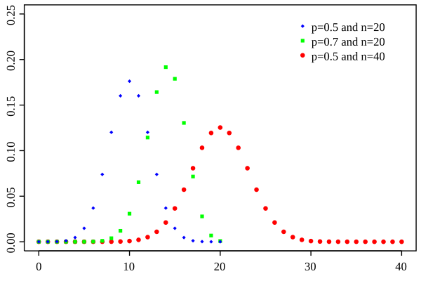
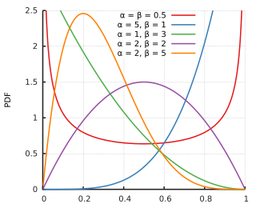
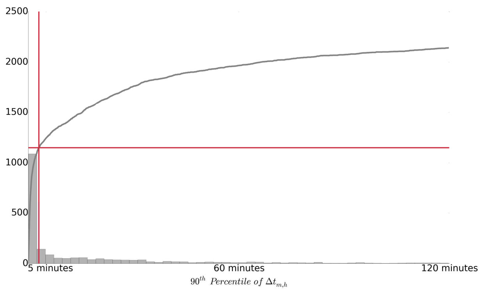

## Introduction

As MOOC (Massive Open Online Courses) become more popular, the cheating strategies that people have become more widespread. One main cheating strategy is to employ a 'harvester' account to gather the answers and a 'master' account to submit the correct answers. This mainly works because MOOCs often provide the correct answer after submission in order to engage learning. This cheating strategy CAMEO (Copying Answers using Multiple Existences Online) holds a serious threat to the sanctity of MOOCs. This paper goes over a detection algorithm for CAMEO-based cheating.

## Definitions

We define $$\Delta t_{m,h,c,i} = t_{m,c,i} - t_{h,c,i}$$ as the difference in time between when the master account, m, submits a correct answer and the time that a harvester account, h, acquires the correct answer for a common item, i, in a given MOOC course, c. 

$$t_{m,c,i}$$ is in the server log files while $$t_{h,c,i}$$ is taken as the time when the user presses "Show Answer" button. 

We'll call the harvester account the "candidate harvester" (CM) and the master account the "candidate master" (CM). Our goal is to asssess if the times between the CH and CM are coincidental enough.

## Algorithm

There are five main filters to detect these CAMEO users.

### Filter 1: The Bayesian criterion

We start with a function

$$x_{m,h,c} = \sum_{i=1}^nI(\Delta t_{m,h,c,i} > 0)$$

We call I the indicator function where I(x) = 1 if x is true and 0 otherwise. Since $$\Delta t_{m,h,c,i} > 0$$ is the time difference between when a harvester account acquires the correct answer and when the master account submits it, this function defines the number of times that CH precedes CM. 

We can assume x as being binomially distributed since we have n items and for each item, there is a probability p that CH precedes CM. 

$$ x|n, \pi \sim Binomial(n, \pi)$$

$$Binomial Distribution Formula: P(x) = \binom nx p^x (1-p)^{n-x}$$

  

Now, we call $\pi$ as p the proportion of positive $$\Delta t_{m,h,c,i} > 0$$ values out of n. We assume $\pi$ has a beta distribution. 

$$ \pi|\alpha,\beta \sim Beta(\alpha, \beta)$$

We set $\alpha$=0.5 and $\beta$=0.5 after observing distributions.

  

Filter 1 selects CH-CM pairs with a 90% probability of $$\pi _{m,h,c} > 0.9$$. If we break down what this means, we're selecting pairs of accounts where the proportion of correct answers they got is above the 90% using $$\pi _{m,h,c} > 0.9$$ as our assumed proportion of correct answers.

### Filter 2: Setting the cutoff threshold

As the previous filter doesn't account for the time difference between when the harvester account got the answer and when the master account submitted it, we factor that into the second filter. 

Filter 2 uses the 90th percentile of the $$\Delta t_{m,h,c}$$ distribution and sets the cutoff to 5 minutes meaning that 90% of the $$\Delta t_{m,h,c}$$ values must be less than 5 minutes. In other words, for 90% of the items/problems submitted the difference in time between the CH and CM has to be positive and within 5 minutes.

5 minutes was selected as the cutoff since the number of CAMEO users in the figure below don't change as drastically once we start going past 5 minutes.

  

