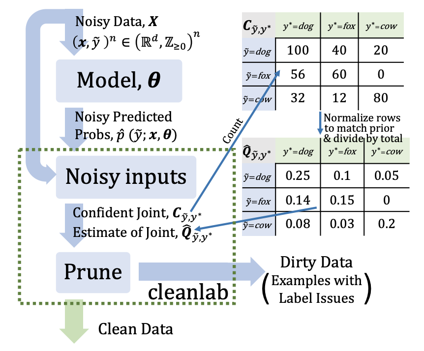

# Introduction

This paper talks about a new technique called confident learning that attempts to address the problem of noisy labels. Large widely used datasets with noisy labels have become quite common nowadays. Even the most prominent ones like ImageNet and MSINT have mislabeled data. The paper's work focuses on creating a joint distribution between the noisy and uncorrupted lables. This distribution is then used to figure out the noisy labels and prune them resulting in a clean dataset.

# Algorithm

We start with our noisy data. The model is treated as a parameter to decouple it from the CL procedure. The first step is to pass the noisy data through our model given. The model should give us a mapping of a data example to the probabilities of it being in each class. For instance, if we have 3 classes "dog, fox, cow", we should get a mapping as such $$x_1=[0.3, 0.5, 0.2]$$. The probabilities will add up to 1. This means that this data piece has a 0.3 probability of being a dog, 0.5 probability of being a fox, and a 0.2 probability of being a cow. These are our initial predicted probabilities that will be used to create the confident joint. 

We now create a confident threshold for each class by calculating the mean probability that a data point is labeled k. 
For example, for a class k, we would have

$$ConfidentThreshold(Class = k) = \sum_{i=1}^nP(label=k | x_i) / n$$

We take our data point that has predicted probabilites $$x_1=[0.3, 0.5, 0.2]$$ and compare it to the confident threshold for each class. Let's say that the confident thresholds for "dog, fox, and cow" respectively are [0.4, 0.4, 0.2]. For classes "fox" and "cow", both probabilities pass the confident threshold so we take the class that has the max probability out of those two. Since "fox" has a probability of 0.4 whereas "cow" has a probability of 0.2, we would take "fox" as the true label. For data points that don't have any probabilities above the confident threshold, we take them out as not having "strong confidence". 

We create our confident joint by adding up the number of data points in each class and creating a confusion matrix. On the left axis, we have the predicted label from the model and on the top we have the true labels after the confident threshold. We then fill the diagonals with a min of 1 to ensure that there is at least 1 correctly labeled example in each class. At the end, we normalize the rows and columns by summing all the entries up and dividing by the total.

# Pruning Techniques

Once we have our confident joint, we start pruning examples that have wrong labels or "label issues". The paper goes over multiple different approaches. I'll go over a few of them. 

## Low 'Self Confidence'

The self confidence is given by the initial predicted probabilities that we calculated. We remove the training examples that have the least self-confidence. To calculate the number to remove, we add up the off diagonals confident joint and use that probability * the number of labels. If we take Figure 1 as an example, the probability of an off-diagonal would be 0.4 so we would multiply 0.4 * (# of labels) and remove that many ordered by least self-confidence.

## Prune by Class

n/a

# Conclusion

Testing it on a variety of datasets (images, text, speech), the confident learning algorithm is able to take out incorrectly labeled data and improve the accuracy of the learning algorithm.
